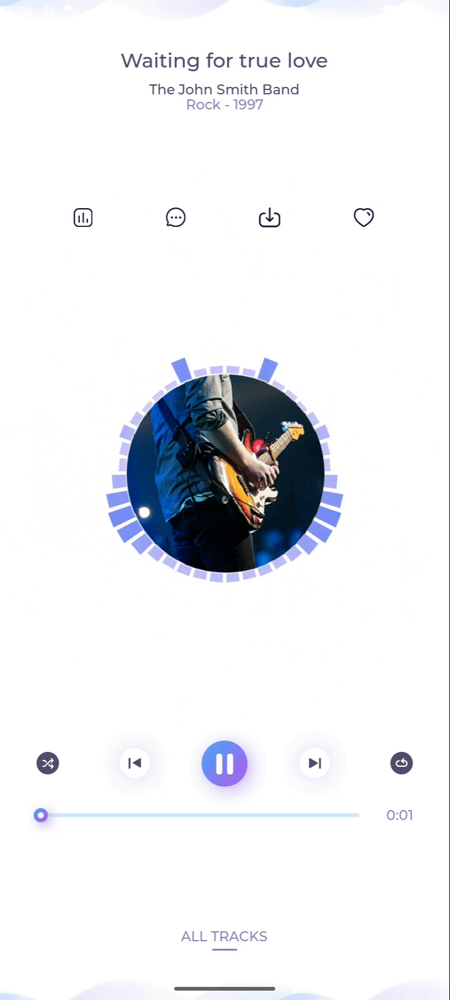

# Android Native with LVGL

LVGL is an embedded graphics library to create beautiful UIs for any MCU, MPU and display type. Mobile phone display is not a main target.

Checkout the official site [LVGL](https://lvgl.io/) for more info and demos.

## Music demo

Below you can see the demo music "working" on Android Emulator:

To run yourself:
1. Enable `LV_ENABLE_DEMOS` flag on CMakeLists.txt
2. Open `lv_conf.h` and enable `LV_USE_DEMO_MUSIC`, `LV_DEMO_MUSIC_LARGE` and `LV_DEMO_MUSIC_AUTO_PLAY` from `0` to `1`
3. On `lv_conf.h` enable `LV_FONT_MONTSERRAT_22` and `LV_FONT_MONTSERRAT_32` from `0` to `1`
4. Now you can build and run

Screenshots
-----------

## Features

[x] - Draw widgets
[x] - Touch clickable widgets
[ ] - Scroll widgets
[ ] - Load asserts (images, fonts, etc)
[ ] - Screen rotation with state restoration
